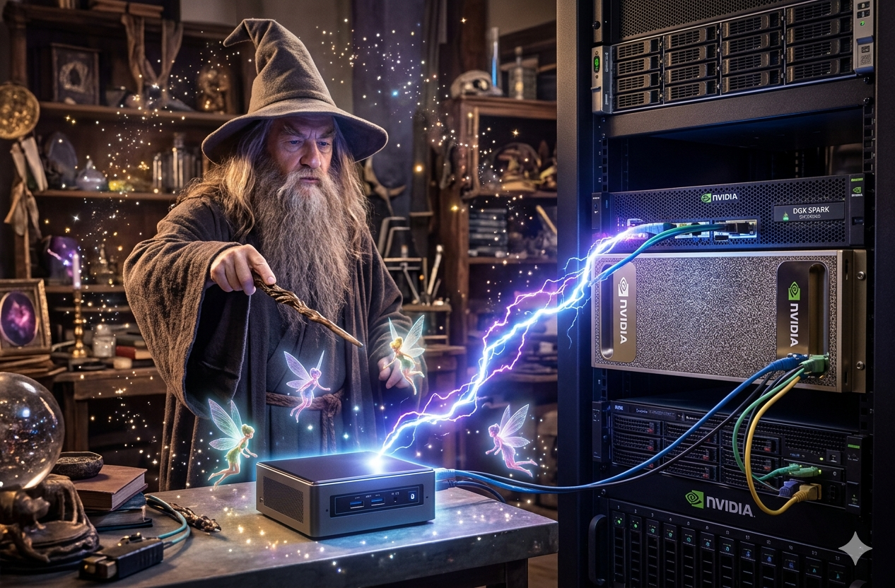

# luminAIge

Sovereign AI infrastructure that is RAG-enabled, running entirely on local hardware.

Inference runs on an NVIDIA DGX Spark (Ollama). All orchestration services and the NemoClaw agent framework run on a 3-node Harvester cluster (RKE2 on Kubernetes). RAG is sourced primarily from the public internet via self-hosted web search.



Functional Requirements

| Function | Solution |
|:---------|:---------|
| Web UI | OpenWebUI |
| RAG | Qdrant (vector DB) + SearXNG (web search) |
| Inference Engine | Ollama |
| Inference Model | Nemotron 3 Super 120B (+ others via Ollama) |
| Inference Hardware | NVIDIA DGX Spark |
| Orchestration Node | 3-node Harvester cluster — RKE2 (Kubernetes) |
| Agent Framework | NemoClaw (Kubernetes deployment on RKE2 cluster, inference routed to Ollama on DGX Spark) |

## Build Order

1. **Harvester cluster** — provision 3 nodes, install Harvester, create RKE2 guest cluster (`Scripts/Harvester_setup.sh`)
2. **DGX Spark** — install Ollama, pull Nemotron 3 Super 120B, verify API endpoint (`:11434`) (`Scripts/Spark_setup.sh`)
3. **Cluster services** — deploy OpenWebUI + Qdrant + SearXNG to Kubernetes, point OpenWebUI at Ollama on DGX Spark
4. **RAG** — configure OpenWebUI web search (SearXNG) and document pipeline (Qdrant)
5. **NemoClaw** — deploy to Kubernetes on RKE2 cluster (configure to use remote Ollama on DGX Spark at `:11434`)

## Cluster Services (Step 3)

Services run as Kubernetes workloads on the RKE2 cluster hosted in Harvester. Manifests are in `k8s/`. OpenWebUI exposes a LoadBalancer service on port 3000; Qdrant and SearXNG are ClusterIP (internal only).

```bash
# 1. Edit k8s/configmap.yaml — set DGX_SPARK_IP and HARVESTER_IP

# 2. Create your secrets file
cp k8s/secret.example.yaml k8s/secret.yaml
# Edit k8s/secret.yaml: fill in base64-encoded values
#   SEARXNG_SECRET_KEY: openssl rand -hex 32 | tr -d '\n' | base64
#   NGC_API_KEY:        echo -n '<your-key>' | base64

# 3. Deploy
Scripts/Harvester_setup.sh 1

# 4. Check rollout and get OpenWebUI endpoint
Scripts/Harvester_setup.sh 2
```

OpenWebUI will be available at `http://<LoadBalancer-IP>:3000`.

A Docker Compose reference stack is in `compose/compose.yml` for local dev/testing only.

[luminAI Documentation](https://luminAI.kubernerdes.com) (TBC later)
